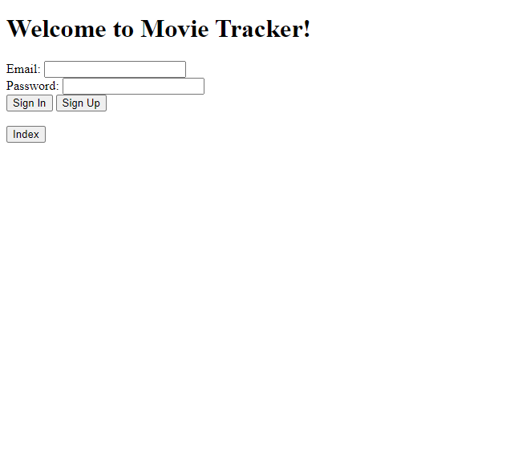
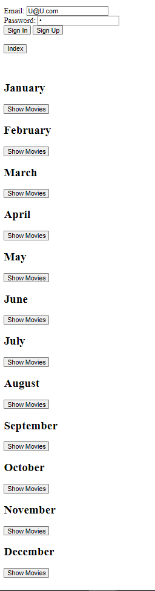

# Movies of the Month Tracker App
This app is designed to schedule and track the movies that you want to watch/have watched throughout the year.
The idea came from a tradition that a friend and I have called "No Good November" where we watch bad movies throughout the month of November.
# Screenshots
## Landing Page:

## After Signing in and Clicking Index:

---
Each 'Show Movies' button is designed to show the movie items in the month Schema. Functionality isn't 100% there yet.
## Technologies Used:
- HTML
- CSS
- Javascript
- Node.js
- Express
- MongoDB
- Mongoose
- Bcrypt
- Cors
- JsonWebToken
- Passport/Passport-jwt
## ERD
.jpg)
## Routes Table: 

| Name        | Path                             |HTTP Verb    |Purpose             |
| ----------- | -------------------------------- | ----------- | ------------------ |
| Index       | /months/                        |GET          |Displays all months for the user|
| Create      | /movies/                        |POST         |Creates new movie  |
| Show        | /month/:monthId               |GET          |Displays one month's contents |
| Update      | /movies/:movieId               |PATCH        |Updates one movie  |
| Delete      | /movies/:movieId               |DELETE       |Deletes one movie  |
| Show        | /movies/:movieId               |GET          |Displays one movie |
| SignUp      | /sign-up                         |POST         |Creates new login   |
| SignIn      | /sign-in                         |POST         |Logs user in        |
